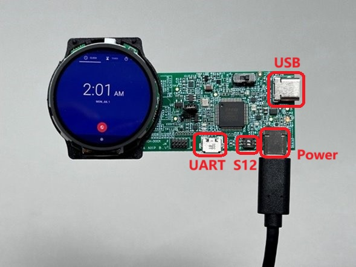
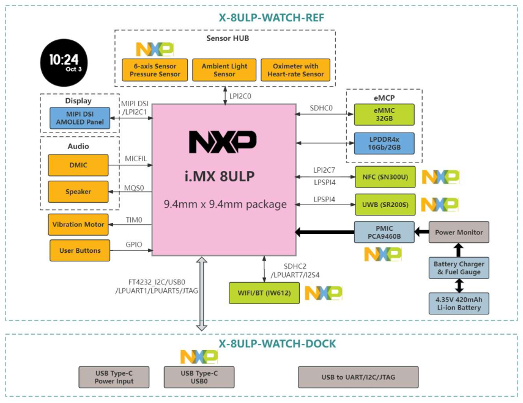
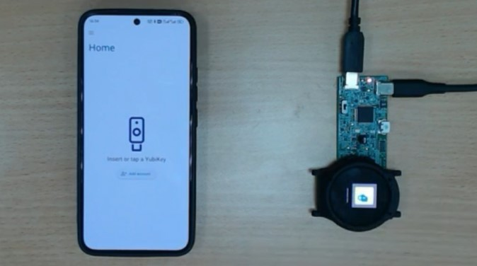

# i.MX8ULP Watch

[](https://spdx.org/licenses/GPL-2.0-only.html)
[](https://www.nxp.com/products/i.MX8ULP)


[](https://www.nxp.com/design/design-center/software/embedded-software/i-mx-software/android-os-for-i-mx-applications-processors:IMXANDROID?tab=In-Depth_Tab)


i.MX8ULP Watch offers a design for Low Power Wearable device. The demo is based on Android OS.

Board display



Board block diagram



## Table of Contents

- [1 Software](#1-software)
- [2 Hardware](#2-hardware)
- [3 Setup](#3-setup)
- [4 Results](#4-results)
- [5 FAQs](#5-faqs)
- [6 Support](#6-support)
- [7 Release Notes](#7-release-notes)

## 1 Software

i.MX8ULP Watch is based on Android 14.0.0_1.0.0. The supported components are as follows.

| Component | Support status |
| --- | --- |
| 6-axis Sensor (step counter) | ✓   |
| Pressure Sensor |     |
| Ambient Light Sensor |     |
| Oximeter With Heart-Rate Sensor | Heart-Rate only |
| WIFI/BT | ✓   |
| Vibration Motor |     |
| Speaker |     |
| Microphone |     |
| NFC | ✓   |
| UWB |     |

## 2 Hardware

X-8ULP-WATCH-REF

## 3 Setup

### SDK Building and Flashing

- Download [SDK source package](https://www.nxp.com/webapp/Download?colCode=14.0.0_1.0.0_ANDROID_SOURCE&appType=license) and the related [Documentation](https://www.nxp.com/docs/en/supporting-information/android_14.0.0_1.0.0_docs.zip) .
    
- Decompress the source package and modify the imx_android_setup.sh as follows
    
    ```
    diff --git a/imx_android_setup.sh b/imx_android_setup.sh
    index 324ec67..4618679 100644
    --- a/imx_android_setup.sh
    +++ b/imx_android_setup.sh
        @@ -26,7 +26,7 @@ if [ ! -d "$android_builddir" ]; then
         mkdir "$android_builddir"
         cd "$android_builddir"
    -    repo init -u https://github.com/nxp-imx/imx-manifest -b imx-android-14 -m imx-android-14.0.0_1.0.0.xml
    +    repo init -u https://github.com/nxp-imx/imx-manifest -b imx-android-14 -m imx-android-14.0.0_1.0.0-nfc.xml
    ```
        
- Follow the steps of i.MX Android User Guide in [Documentation](https://www.nxp.com/docs/en/supporting-information/android_14.0.0_1.0.0_docs.zip) until the chapter of  "Get i.MX Android release source code" is completed. Then **MY_ANDROID** will be exported.
    
- Export ARMGCC_DIR and Upgrade cmake.
  - Download the gcc tool chain from [arm Developers GNU-RM Downloads](https://developer.arm.com/open-source/gnu-toolchain/gnu-rm/downloads) page, it is recommended to download the **7-2018-q2-update** version.Extract it to your install directory, and export the directory and add this to /etc/profile.

    ```
    $ export ARMGCC_DIR=<install_dir>/gcc-arm-none-eabi-7-2018-q2-update
    ```

  - Upgrade the cmake version to or above **3\.13\.0**. if the cmake version on your machine is not above 3.13.0, you can follow below steps to upgrade it:

    ```
    $ wget https://github.com/Kitware/CMake/releases/download/v3.13.2/
    $ cmake-3.13.2.tar.gz
    $ tar -xzvf cmake-3.13.2.tar.gz; cd cmake-3.13.2;
    $ sudo ./bootstrap
    $ sudo make
    $ sudo make install
    ```

- Download the rest patches and patch them all.
    
    ```
    $ cd $MY_ANDROID/../
    $ git clone https://github.com/nxp-imx-support/imx-smart-watch -b imx-android-14.0.0_1.0.0
    $ chmod +x ./imx-smart-watch/patch_all/patch_all.sh
    $ ./imx-smart-watch/patch_all/patch_all.sh
    ```

- Continue to build SDK according to i.MX Android User Guide. And lunch the following combination.
    
    ```
    $ lunch watch_8ulp-userdebug
    ```
        
- The following images will be used after building finished.
    
    | Images | Descriptions |
    | --- | --- |
    | boot.img |     |
    | dtbo-imx8ulp.img |     |
    | init_boot.img |     |
    | partition-table.img |     |
    | super.img |     |
    | u-boot-imx8ulp.imx |     |
    | u-boot-imx8ulp-evk-uuu.imx |     |
    | uuu_imx_android_flash.bat |     |
    | vbmeta-imx8ulp.img |     |
    | vendor_boot.img |     |
        
- Switch S12 to b’10 to make i.MX8ULP enter download mode.
    
- Flash the board with the following command on Windows CMD console.
    
    ```
    .\uuu_imx_android_flash.bat -f imx8ulp -a -e
    ```
        
- Switch S12 to b’01 after flashing done. to make i.MX8ULP enter EMMC boot mode.
    
- Now i.MX8ULP watch can boot.
    

### Watch-face APK

Please refer to the [link](https://community.nxp.com/t5/i-MX-Processors-Knowledge-Base/Run-a-watch-face-APK-on-i-MX8ULP-watch-board-based-on-Android-14/ta-p/2052833) to get and build the APK.

## 4 Results

### NFC demonstration

  

- Open Yubico Authenticator APK on phone which acts as NFC reader.
    
- Open Watch-face APK on iMX8ULP watch which acts as NFC Tag. Switch to NFC page.
    
- Bring the two closer together and NFC reader will read the Tag information.
    

## 5 FAQs

## 6 Support

For more general technical questions, enter your questions on the [NXP Community Forum](https://community.nxp.com/)

 [](https://www.youtube.com/NXP_Semiconductors)
 [](https://www.linkedin.com/company/nxp-semiconductors)
 [](https://www.facebook.com/nxpsemi/)
 [](https://twitter.com/NXP)

## 7 Release Notes

| Version | Description | Date |
| --- | --- | --- |
| 1.0.0 | Initial release | March 6<sup>th</sup> 2025 |

## Licensing

*i.MX8ULP Watch* is licensed under the [GPL-2.0-only License](https://spdx.org/licenses/GPL-2.0-only.html).
